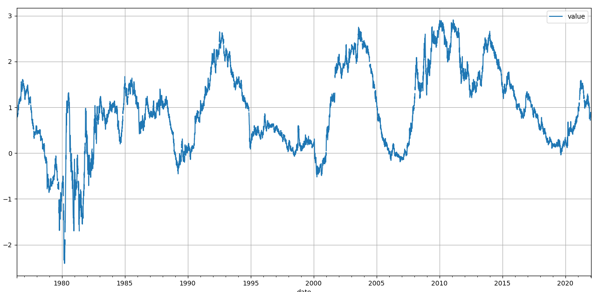
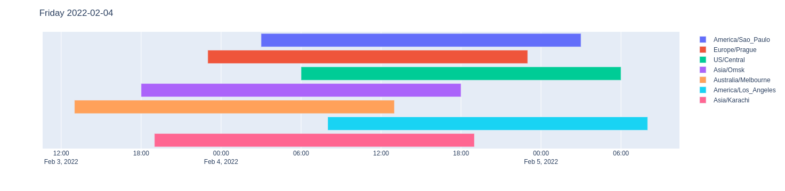

<div id="top"></div>

# Python client for Federal Reserve Bank of St. Louis

## Description

> This is a third-party client that is developed and maintained independently of the Federal Reserve Bank. As such, it is not affiliated with or supported by the institution.

The Federal Reserve Bank of St. Louis is one of 12 regional Reserve Banks that, along with the Board of Governors in Washington, D.C., make up the United States' central bank.
The https://stlouisfed.org site currently provides more than 816,000 time series from 107 sources using the [FRED](https://fred.stlouisfed.org/) (Federal Reserve Economic Data)
and [ALFRED](https://alfred.stlouisfed.org/) (Archival FRED) interfaces. It is also possible to obtain detailed geographical data from [FRED Maps](https://fredhelp.stlouisfed.org/fred/maps/find-maps/how-can-i-find-maps-in-fred/) or more than 500,000 publications from the digital library [FRASER](https://fraser.stlouisfed.org/).

The `pystlouisfed` package covers the entire FRED / ALFRED / FRED Maps / FRASER API and returns most of the results as `pandas.DataFrame`, which is cast to the correct data types
with a specific index. So "date", "realtime_start", "observation_start" etc are `datetime64` type, "value" is `float` and not `str`, missing values are `np.NaN` and not "." etc ...
The naming convention of methods and parameters is the same as in the target API and everything is detailed [documented](https://tomaskoutek.github.io/pystlouisfed/). There is also
a default rate-limiter, which ensures that the API call limit is not exceeded.

## Getting Started

### Installing

```
pip install pystlouisfed
```

### Dependencies

* [pandas](https://pandas.pydata.org/) for time series data and lists
* [geopandas](https://geopandas.org/en/stable/) for time series data and lists
* [requests](https://docs.python-requests.org/en/latest/) for API calls
* [sickle](https://sickle.readthedocs.io/) for FRASER oai-pmh API
* [rush](https://github.com/sigmavirus24/rush) for limiting API calls

## Usage

First you need to register and create an [API key](https://fred.stlouisfed.org/docs/api/api_key.html).

### Documentation

The [documentation](https://tomaskoutek.github.io/pystlouisfed/) contains a description of all methods, enums, classes and API calls with individual examples and their results. Or
you can display a detailed description directly with the help function.

For example:

```python
from pystlouisfed import FRED

help(FRED.series_search)
```

### Let 's start with FRED and ALFRED

Most FRED (ALFRED) API calls return a list of objects (`pandas.DataFrame`), but there are a few exceptions. A few methods do not return a `pandas.DataFrame`, but only one specific
object from the [pystlouisfed.models](https://tomaskoutek.github.io/pystlouisfed/models.html).

For example:

"Hey FRED give me [Category](https://tomaskoutek.github.io/pystlouisfed/models.html#pystlouisfed.models.Category) with ID 125"

```python
from pystlouisfed import FRED

fred = FRED(api_key='abcdefghijklmnopqrstuvwxyz123456')
category = fred.category(category_id=125)

# Category(id=125, name='Trade Balance', parent_id=13)
```

or [Source](https://tomaskoutek.github.io/pystlouisfed/models.html#pystlouisfed.models.Source) with ID 1

```python
from pystlouisfed import FRED

fred = FRED(api_key='abcdefghijklmnopqrstuvwxyz123456')
fred.source(source_id=1)

# Source(id=1, realtime_start='2022-01-14', realtime_end='2022-01-14', name='Board of Governors of the Federal Reserve System (US)', link='http://www.federalreserve.gov/')
```

other methods return `pandas.DataFrame`
For example method `FRED.category_series` (all series for a specific category)

```python
from pystlouisfed import FRED

fred = FRED(api_key='abcdefghijklmnopqrstuvwxyz123456')
df = fred.category_series(category_id=125)

print(df.head())
```

```
        realtime_start realtime_end                                              title observation_start observation_end  frequency frequency_short                units units_short      seasonal_adjustment seasonal_adjustment_short              last_updated  popularity  group_popularity                                              notes
id                                                                                                                                                                                                                                                                                                                                                
AITGCBN     2022-02-05   2022-02-05  Advance U.S. International Trade in Goods: Bal...        2021-12-01      2021-12-01    Monthly               M  Millions of Dollars   Mil. of $  Not Seasonally Adjusted                       NSA 2022-01-26 13:31:05+00:00           3                26  This advance estimate represents the current m...
AITGCBS     2022-02-05   2022-02-05  Advance U.S. International Trade in Goods: Bal...        2021-12-01      2021-12-01    Monthly               M  Millions of Dollars   Mil. of $      Seasonally Adjusted                        SA 2022-01-26 13:31:02+00:00          26                26  This advance estimate represents the current m...
BOPBCA      2022-02-05   2022-02-05          Balance on Current Account (DISCONTINUED)        1960-01-01      2014-01-01  Quarterly               Q  Billions of Dollars   Bil. of $      Seasonally Adjusted                        SA 2014-06-18 13:41:28+00:00          10                11  This series has been discontinued as a result ...
BOPBCAA     2022-02-05   2022-02-05          Balance on Current Account (DISCONTINUED)        1960-01-01      2013-01-01     Annual               A  Billions of Dollars   Bil. of $  Not Seasonally Adjusted                       NSA 2014-06-18 13:41:28+00:00           2                11  This series has been discontinued as a result ...
BOPBCAN     2022-02-05   2022-02-05          Balance on Current Account (DISCONTINUED)        1960-01-01      2014-01-01  Quarterly               Q  Billions of Dollars   Bil. of $  Not Seasonally Adjusted                       NSA 2014-06-18 13:41:28+00:00           1                11  This series has been discontinued as a result ...
```

or method `FRED.series_search` (search series by text)

```python
from pystlouisfed import FRED

fred = FRED(api_key='abcdefghijklmnopqrstuvwxyz123456')
df = fred.series_search(search_text='monetary service index')

print(df.head())
```

```
        realtime_start realtime_end                                            title observation_start observation_end frequency frequency_short                units units_short  seasonal_adjustment seasonal_adjustment_short              last_updated  popularity  group_popularity                                              notes
id                                                                                                                                                                                                                                                                                                                                         
MSIMZMP     2022-02-05   2022-02-05         Monetary Services Index: MZM (preferred)        1967-01-01      2013-12-01   Monthly               M  Billions of Dollars   Bil. of $  Seasonally Adjusted                        SA 2014-01-17 13:16:42+00:00          20                20  The MSI measure the flow of monetary services ...
MSIM2       2022-02-05   2022-02-05          Monetary Services Index: M2 (preferred)        1967-01-01      2013-12-01   Monthly               M  Billions of Dollars   Bil. of $  Seasonally Adjusted                        SA 2014-01-17 13:16:44+00:00          16                16  The MSI measure the flow of monetary services ...
MSIALLP     2022-02-05   2022-02-05  Monetary Services Index: ALL Assets (preferred)        1967-01-01      2013-12-01   Monthly               M  Billions of Dollars   Bil. of $  Seasonally Adjusted                        SA 2014-01-17 13:16:45+00:00          14                14  The MSI measure the flow of monetary services ...
MSIM1P      2022-02-05   2022-02-05          Monetary Services Index: M1 (preferred)        1967-01-01      2013-12-01   Monthly               M  Billions of Dollars   Bil. of $  Seasonally Adjusted                        SA 2014-01-17 13:16:45+00:00           9                 9  The MSI measure the flow of monetary services ...
MSIM2A      2022-02-05   2022-02-05        Monetary Services Index: M2 (alternative)        1967-01-01      2013-12-01   Monthly               M  Billions of Dollars   Bil. of $  Seasonally Adjusted                        SA 2014-01-17 13:16:44+00:00           8                 8  The MSI measure the flow of monetary services ...
```

or method `FRED.series_observations` (observations for specific series ID)

```python
from matplotlib import pyplot as plt
from pystlouisfed import FRED

fred = FRED(api_key='abcdefghijklmnopqrstuvwxyz123456')
# T10Y2Y  -  10-Year Treasury Constant Maturity Minus 2-Year Treasury Constant Maturity
df = fred.series_observations(series_id='T10Y2Y')

df.plot(y='value', grid=True)
plt.show()
```



In addition, each DataFrame has correctly set data types.

```python
from pystlouisfed import FRED

fred = FRED(api_key='abcdefghijklmnopqrstuvwxyz123456')
df = fred.category_series(125)

print(df.info(verbose=True, memory_usage='deep'))
```

```
<class 'pandas.core.frame.DataFrame'>
Index: 47 entries, AITGCBN to IEABCSN
Data columns (total 15 columns):
 #   Column                     Non-Null Count  Dtype              
---  ------                     --------------  -----              
 0   realtime_start             47 non-null     datetime64[ns]     
 1   realtime_end               47 non-null     datetime64[ns]     
 2   title                      47 non-null     string             
 3   observation_start          47 non-null     datetime64[ns]     
 4   observation_end            47 non-null     datetime64[ns]     
 5   frequency                  47 non-null     category           
 6   frequency_short            47 non-null     category           
 7   units                      47 non-null     category           
 8   units_short                47 non-null     category           
 9   seasonal_adjustment        47 non-null     category           
 10  seasonal_adjustment_short  47 non-null     category           
 11  last_updated               47 non-null     datetime64[ns, UTC]
 12  popularity                 47 non-null     int64              
 13  group_popularity           47 non-null     int64              
 14  notes                      47 non-null     string             
dtypes: category(6), datetime64[ns, UTC](1), datetime64[ns](4), int64(2), string(2)
memory usage: 25.0 KB
```

<p align="right">(<a href="#top">back to top</a>)</p>

### Working with Enums

FRED (ALFRED) has many different parameters, which are not the same for each method. So there is no need to remember everything or keep looking at the documentation.
`pystlouisfed` uses the [Enums](https://tomaskoutek.github.io/pystlouisfed/enums.html) constants. For example, the API endpoint FRED:series_observations (and
method `FRED.series_observations`) has the optional parameters
"units", "frequency", "aggregation_method" or "output_type":

```
def series_observations(
        self,
        series_id: str,
        realtime_start: date = None,
        realtime_end: date = None,
        sort_order: enums.SortOrder = enums.SortOrder.asc,
        observation_start: date = date(1776, 7, 4),
        observation_end: date = date(9999, 12, 31),
        units: enums.Unit = enums.Unit.lin,
        frequency: enums.Frequency = None,
        aggregation_method: enums.AggregationMethod = enums.AggregationMethod.average,
        output_type: enums.OutputType = enums.OutputType.realtime_period,
        vintage_dates: List[str] = None
) -> pd.DataFrame:
```

But what should be the value? For example, for the parameter "aggregation_method" it is possible to use `pystlouisfed.AggregationMethod`:

```python
from enum import Enum


class AggregationMethod(Enum):
    """
    A key that indicates the aggregation method used for frequency aggregation.
    """

    avg = 'avg'
    """
    Average (same as `pystlouisfed.enums.AggregationMethod.average`)
    """
    average = 'avg'
    """
    Average (same as `pystlouisfed.enums.AggregationMethod.avg`)
    """
    sum = 'sum'
    """
    Sum
    """
    eop = 'eop'
    """
    End of Period (same as `pystlouisfed.enums.AggregationMethod.end_of_period`)
    """
    end_of_period = 'eop'
    """
    End of Period (same as `pystlouisfed.enums.AggregationMethod.eop`)
    """
```

The method above can then be called as follows:

```python
from pystlouisfed import FRED, AggregationMethod, Frequency

fred = FRED(api_key='abcdefghijklmnopqrstuvwxyz123456')
df = fred.series_observations(series_id='T10Y2Y', aggregation_method=AggregationMethod.end_of_period, frequency=Frequency.weekly_ending_friday)
```

### Working with rate limiting

The API is limited to 120 calls per 60 seconds.
`pystlouisfed` therefore, by default uses [rush](https://github.com/sigmavirus24/rush), which monitors this limit!
So it is not a problem to download all series (~800) with the tag "daily" and "nsa" (Not Seasonally Adjusted) without exceeding any limits:

```python
from pystlouisfed import FRED

fred = FRED(api_key='abcdefghijklmnopqrstuvwxyz123456')
series = fred.tags_series(tag_names=['daily', 'nsa'], exclude_tag_names=['discontinued'])

for series_id in series.index.values:
    df = fred.series_observations(series_id=series_id)
```

<p align="right">(<a href="#top">back to top</a>)</p>

### Working with data revisions

> https://fred.stlouisfed.org/docs/api/fred/fred_vs_alfred.html
>
> Most users are interested in FRED and not ALFRED. In other words, most people want to know what's the most accurate information about the past that is available today (FRED) not what information was known on some past date in history (ALFRED®).
> Note that the FRED and ALFRED web services use the same URLs but with different options. The default options for each URL have been chosen to make the most sense for FRED users. In particular by default, the real-time period has been set to today's date. ALFRED® users can change the real-time period by setting the realtime_start and realtime_end variables.

For example, "GDP" has 303 values for today.

```python
from pystlouisfed import FRED

fred = FRED(api_key='abcdefghijklmnopqrstuvwxyz123456')
df = fred.series_observations(series_id='GDP')

print(len(df))
# 303
```

But if we request all the changes, we get 3068 values!

```python
from pystlouisfed import FRED
from datetime import date

fred = FRED(api_key='abcdefghijklmnopqrstuvwxyz123456')
df = fred.series_observations(series_id='GDP', realtime_start=date(1776, 7, 4))

print(len(df))
# 3068
```

Of course, it is possible to set the range or only one day (set same date value for `realtime_start` and `realtime_end`). Let's say we want all changes between "2021-11-01" and "
2022-01-01":

```python
from pystlouisfed import FRED
from datetime import date

fred = FRED(api_key='abcdefghijklmnopqrstuvwxyz123456')
df = fred.series_observations(series_id='GDP', realtime_start=date(2021, 11, 1), realtime_end=date(2022, 1, 1))

df.loc['2021-07-01':'2021-07-01']
```

and we see how the value for day "2021-07-01" has changed.

```
           realtime_start realtime_end      value
date                                             
2021-07-01     2021-11-01   2021-11-23  23173.496
2021-07-01     2021-11-24   2021-12-21  23187.042
2021-07-01     2021-12-22   2022-01-01  23202.344
```

Between dates "2021-11-01" - "2021-11-23" was 23173.496, then until "2021-12-21" at 23187.042 and finally at 23202.344. I think this is important information for backtesting.
Because the backtest on the current/last data will be wrong.

Many other features in the [documentation](https://tomaskoutek.github.io/pystlouisfed/client.html#pystlouisfed.client.FRED).

<p align="right">(<a href="#top">back to top</a>)</p>


### Working with TimeZones

This functionality is currently on the TODO list.

FRED/ALFRED works with date in 99% of cases. 
But what is a date? For example, the friday "2022-02-04" can be almost anything - it depends on the time zone:



Why we are interested in this?

Let's say we are in the "Europe/Prague" timezone (UTC+1) and at 2:00am we call the method:

```python
from pystlouisfed import FRED
from datetime import date

fred = FRED(api_key='abcdefghijklmnopqrstuvwxyz123456')
fred.series_observations(series_id='GDP', realtime_start=date.today(), realtime_end=date.today())
```

FRED/ALFRED will return the error:
> "Bad Request. Variable realtime_start can not be after today's date..." 

because it works in the **timezone "US/Central"** (UTC−06:00)! 
Probably all the date values that the API returns are in "US/Central", but I haven't verified it.

<p align="right">(<a href="#top">back to top</a>)</p>


### FRED Maps

> https://fredaccount.stlouisfed.org/public/dashboard/83217
>
> Maps provide a cross-sectional perspective that lets you compare regions on a map while complementing and expanding the data analysis you get on a time-series graph. 
> FRED has 9 types of maps: 
> - U.S. counties, 
> - U.S. metro areas, 
> - U.S. states, 
> - nations, 
> - Federal Reserve Districts, 
> - Census regions, 
> - Census divisions, 
> - BEA regions 
> - NECTAs (New England city and town areas)

For example, the `FREDMaps.shapes` method returns a [geopandas.GeoDataFrame](https://geopandas.org/en/stable/docs/reference/api/geopandas.GeoDataFrame.html).

This result can be plotted:

```python
import plotly.express as px
from pystlouisfed import FREDMaps, ShapeType

gdf = FREDMaps(api_key="abcdefghijklmnopqrstuvwxyz123456") \
    .shapes(shape=ShapeType.country) \
    .to_crs(epsg=4326) \
    .set_index("name")

fig = px.choropleth(
    gdf,
    geojson=gdf.geometry,
    locations=gdf.index,
    color="fips",
)

fig.update_layout(width=1200, height=1000, showlegend=False)
fig.update_geos(fitbounds="locations", visible=False)
fig.show()
```


Or it is possible to return data for a specific series ID:

```python
from pystlouisfed import FREDMaps

fred_maps = FREDMaps(api_key="abcdefghijklmnopqrstuvwxyz123456")
fred_maps.series_data(series_id='WIPCPI')
           
print(fred_maps.head())

#       region  code  value series_id       year
# 0  Louisiana    22  54622    LAPCPI 2022-01-01
# 1     Nevada    32  61282    NVPCPI 2022-01-01
# 2   Maryland    24  70730    MDPCPI 2022-01-01
# 3    Arizona     4  56667    AZPCPI 2022-01-01
# 4   New York    36  78089    NYPCPI 2022-01-01
```

Other functions in the [documentation](https://tomaskoutek.github.io/pystlouisfed/client.html#pystlouisfed.FREDMaps).

### FRASER

> https://fraser.stlouisfed.org/about
>
> FRASER is a digital library of U.S. economic, financial, and banking history—particularly the history of the Federal Reserve System.
>
> Providing economic information and data to the public is an important mission for the St. Louis Fed started by former St. Louis Fed Research Director Homer Jones in 1958.
> FRASER began as a data preservation and accessibility project of the Federal Reserve Bank of St. Louis in 2004 and now provides access to data and policy documents from the Federal Reserve System and many other institutions.

The Fraser interface communicates using the [OAI-PMH](https://en.wikipedia.org/wiki/Open_Archives_Initiative_Protocol_for_Metadata_Harvesting) API. It is thus possible to obtain
metadata about hundreds of thousands publications.

For example:

```python
from pystlouisfed import FRASER

fraser = FRASER()
record = fraser.get_record(identifier='oai:fraser.stlouisfed.org:title:176')
metadata = record.get_metadata()

print(metadata)
```

```python
{
    "accessCondition": ["http://rightsstatements.org/vocab/NoC-US/1.0/"],
    "classification": ["Y 4.F 49:Ec 7/"],
    "contentType": ["title"],
    "dateIssued": ["February 13-28, 1933"],
    "digitalOrigin": ["reformatted digital"],
    "extent": ["1246 pages"],
    "form": ["print"],
    "genre": ["government publication"],
    "geographic": [None, "United States"],
    "identifier": ["4350587"],
    "internetMediaType": ["application/pdf"],
    "issuance": ["monographic"],
    "language": ["eng"],
    "location": [None],
    "name": [None, None],
    "originInfo": [None],
    "physicalDescription": [None],
    "place": ["Washington"],
    "publisher": ["Government Printing Office"],
    "recordInfo": [None, None, None, None, None, None, None, None],
    "relatedItem": [None],
    "role": [None, None],
    "roleTerm": ["creator", "contributor"],
    "sortDate": ["1933-02-13"],
    "recordIdentifier": ["524", "8499", "8", "97", "4145", "6824", "4293", "5292"],
    "subTitle": ["Hearings Before the Committee on Finance, United States Senate"],
    "subject": [None],
    "namePart": [
        "United States. Congress. Senate. Committee on Finance",
        "1815-",
        "Seventy-Second Congress",
        "1931-1933"
    ],
    "theme": [
        None,
        "Great Depression",
        None,
        "Meltzer\"s History of the Federal Reserve - Primary Sources"
    ],
    "title": ["Investigation of Economic Problems", "Congressional Documents"],
    "titleInfo": [None, None],
    "titlePartNumber": ["Seventy-Second Congress, Second Session, Pursuant to S. Res. 315, February 13 to 28, 1933"],
    "topic": [None, "Economic conditions", None, "Congressional hearings"],
    "typeOfResource": ["text"],
    "url": [
        "https://fraser.stlouisfed.org/oai/title/investigation-economic-problems-176",
        "https://fraser.stlouisfed.org/images/record-thumbnail.jpg",
        "https://fraser.stlouisfed.org/oai/docs/historical/senate/1933sen_investeconprob/1933sen_investeconprob.pdf"
    ]
}
```

Other functions in the [documentation](https://tomaskoutek.github.io/pystlouisfed/client.html#pystlouisfed.client.FRASER).

## License

Distributed under the MIT License. See `LICENSE` for more information.

<p align="right">(<a href="#top">back to top</a>)</p>


